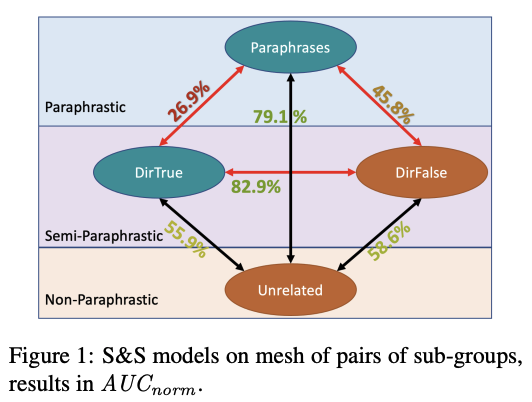

# Langauge Models are Poor Learners of Directional Inference

## 1. Overview

This repository hosts the code for evaluating BERT / RoBERTa LMs' capabilities of directional predicate entailment detection, from the paper [Language Models are Poor Learners of Directional Inference]().

For the BoOQA datasets used in the paper, check out [the BoOQA repository](https://github.com/Teddy-Li/BoOQA).

Here we use the prompt-finetuning approach from [this paper](https://aclanthology.org/2021.eacl-main.108/) as the gauge for LM capabilities. The code in [discrete_prompt_model](./discrete_prompt_model) is adapted from their implementation.
We fixed a bug in the original code, so that the model is able to use the prompts in full; we have also made a few other changes to the training codes for ease of experimentation.

Notably, we have also tried [a subsequent continuous-prompt approach](https://aclanthology.org/2021.emnlp-main.556/), but the results are not as good as the discrete one.
For the sake of clarification, we include the code for the continuous prompt approach in [continuous_prompt_model](./continuous_prompt_model), readers are welcome to try it out (See Section 4).

The datasets we used are included in the [datasets](./datasets) folder. The data is organized as follows:

```
datasets
├── data_en_levy_holt
│   ├── dirnegi_symnegi
│   ├── dirnegi_symnegi_hypo_only
│   ├── dirposi_dirnegi
│   ├── dirposi_dirnegi_hypo_only
│   ├── dirposi_symnegi
│   ├── dirposi_symnegi_hypo_only
│   ├── orig
│   ├── orig_hypo_only
│   ├── symposi_dirnegi
│   ├── symposi_dirnegi_hypo_only
│   ├── symposi_dirposi
│   ├── symposi_dirposi_hypo_only
│   ├── symposi_symnegi
│   └── symposi_symnegi_hypo_only
└── data_en_sherliic
│   └── orig
```

Here, the `orig` folder contains the original dataset, and the other folders contain the respective subsets (see Figure 1 below).
The `hypo_only` folders contain the datasets with the prompts added to the hypothesis only.



Note: `symposi` -> `Paraphrases` in the paper; `symnegi` -> `Unrelated`; `dirposi` -> `DirTrue`; `dirnegi` -> `DirFalse`.

## 2. Requirements

Please note that for the discrete-prompt and continuous-prompt models, there are different (and conflicting) requirements.
Please create two separate conda environments for the two models, and refer to the individual `requirements.txt` files for the requirements.

## 3. Experiments with Discrete Prompts

For the experiments with discrete prompts, we follow the original paper in generating a list of random hyper-parameters for each run. 
We included the generated hyper-parameters in the training shell scripts. For all training scripts we use the same 100 sets of hyper-parameters.
Note that due to the different batch sizes, the gradient_accumulation_steps are changed accordingly between `base` and `large` versions of each model.
The hyper-parameters can also be re-generated with [generate_hyperparam_set.py](./discrete_prompt_model/src/generate_hyperparam_set.py).

### 3.1. Training

The training scripts are the follows: `generic_train_{LM}_{size}.sh`, 
where `{LM}` is the LM model name (`enbert` for BERT, `enr` for RoBERTa), 
and `{size}` is the size of the LM (`base` or `large`).

Training can be carried out with the following command:

```
sbatch -o {output_file} --array 0-99 --gres gpu:1 generic_train_{LM}_{size}.sh {out_name} {data_dir} {data_subdir}
```

where `{output_file}` is the output file for the training logs, `{out_name}` is the name of the output directory, 
`{data_dir}` is the directory of the data, and `{data_subdir}` is the sub-directory of the data. For the directory and 
sub-directory, see the discussions in Section 1.

Two notes on the training scripts:
1. The training scripts are written for the SLURM scheduler. If you are using a different scheduler, you may need to modify the scripts accordingly.
2. For running the training scripts, you should first download the pre-trained BERT / RoBERTa models from [here](https://huggingface.co/), and put them in a directory named `lms` in the parent directory of the repository. Alternatively, you can modify the `--model_name_or_path` argument in the training scripts to point to the correct location of the pre-trained models or simply the names if your server has internet access.

One example of the training command is:

```
sbatch -o ./enr_log_files/levyholt_en_dirp/levyholt_en_dirp_%a_%A.log --array 1-100%8 --gres gpu:1 generic_train_enr_base.sh levyholt_en_dirp data_en_levy_holt levy_holt 5
```
This is for training the RoBERTa-base model on the Levy-Holt dataset with direction-aware prompts.

Additionally, we also provide the training scripts for the symmetric-prompt models as well as the model with fixed transformer layers.
The training commands are the followings respectively:

1. Symmetric prompt: `sbatch -o {output_file} --array 0-99 --gres gpu:1 generic_symmetric_train_{LM}_{size}.sh {out_name} {data_dir} {data_subdir}`
2. Fixed-transformer-layers: `sbatch -o {output_file} --array 0-99 --gres gpu:1 generic_flm_train_enr_base.sh {out_name} {data_dir} {data_subdir}`

### 3.2. Evaluation

To evaluate the trained models, follow the process below:
1. Identify the best hyper-parameters for each model. Use the `find_best_checkpoint_AUC.py` script [here](./discrete_prompt_model/src/find_best_checkpoint_AUC.py), set the arguments according to the help message;
2. Evaluate the best model. Use the [generic_test.sh](./discrete_prompt_model/src/generic_test.sh) script, or the [generic_test_symmetric.sh](./discrete_prompt_model/src/generic_symmetric_test.sh) script for the symmetric-prompt models: `sbatch -o {output_file} --gres gpu:1 generic{(_symmetric)}_test.sh {checkpoint_path} 0.0 {en / hypo_only}`; this will run evaluation on the test sets of all datasets within the scope of our work;

where `{output_file}` is the output file for the evaluation logs, `{checkpoint_path}` is the path to the checkpoint of the best model.

## 4. Experiments with Continuous-Prompt Model

The continuous-prompt model underperform the discrete-prompt one when generalizing across test sets from different datasets in the same task, 
suggesting that it overfits to its training sets, and are less robust than the ones above. 
Therefore, these scripts are included only for interested readers to explore the differences for themselves.

Training scripts are analogous to the ones in Section 3 above. Use the following command:

```
sbatch -o {output_file} --array 0-99 --gres gpu:1 generic_train_{LM}_{size}.sh {out_name} {data_dir} {data_subdir} 5 {best_config_id_from_discrete}
```

Evaluation is alike: similarly retrieve the best model checkpoint with the [find_best_checkpoint_AUC.py](./continuous_prompt_model/src/find_best_checkpoint_AUC.py) within the `continuous_prompt_model` sub-directory;
then evaluate with the [generic_test.sh](./continuous_prompt_model/generic_test.sh) there.

## 5. Citation

If you are interested in our work or use our code in your own research, please cite the following paper:

```
@misc{https://doi.org/10.48550/arxiv.2210.04695,
  doi = {10.48550/ARXIV.2210.04695},
  
  url = {https://arxiv.org/abs/2210.04695},
  
  author = {Li, Tianyi and Hosseini, Mohammad Javad and Weber, Sabine and Steedman, Mark},
  
  keywords = {Computation and Language (cs.CL), FOS: Computer and information sciences, FOS: Computer and information sciences},
  
  title = {Language Models Are Poor Learners of Directional Inference},
  
  publisher = {arXiv},
  
  year = {2022},
  
  copyright = {Creative Commons Attribution Share Alike 4.0 International}
}
```

We also provide the citations for the gauge models we used in our experiments:

```
@inproceedings{schmitt-schutze-2021-language,
    title = "Language Models for Lexical Inference in Context",
    author = {Schmitt, Martin  and
      Sch{\"u}tze, Hinrich},
    booktitle = "Proceedings of the 16th Conference of the European Chapter of the Association for Computational Linguistics: Main Volume",
    month = apr,
    year = "2021",
    address = "Online",
    publisher = "Association for Computational Linguistics",
    url = "https://aclanthology.org/2021.eacl-main.108",
    doi = "10.18653/v1/2021.eacl-main.108",
    pages = "1267--1280",
    abstract = "Lexical inference in context (LIiC) is the task of recognizing textual entailment between two very similar sentences, i.e., sentences that only differ in one expression. It can therefore be seen as a variant of the natural language inference task that is focused on lexical semantics. We formulate and evaluate the first approaches based on pretrained language models (LMs) for this task: (i) a few-shot NLI classifier, (ii) a relation induction approach based on handcrafted patterns expressing the semantics of lexical inference, and (iii) a variant of (ii) with patterns that were automatically extracted from a corpus. All our approaches outperform the previous state of the art, showing the potential of pretrained LMs for LIiC. In an extensive analysis, we investigate factors of success and failure of our three approaches.",
}
```

```
@inproceedings{schmitt-schutze-2021-continuous,
    title = "Continuous Entailment Patterns for Lexical Inference in Context",
    author = {Schmitt, Martin  and
      Sch{\"u}tze, Hinrich},
    booktitle = "Proceedings of the 2021 Conference on Empirical Methods in Natural Language Processing",
    month = nov,
    year = "2021",
    address = "Online and Punta Cana, Dominican Republic",
    publisher = "Association for Computational Linguistics",
    url = "https://aclanthology.org/2021.emnlp-main.556",
    doi = "10.18653/v1/2021.emnlp-main.556",
    pages = "6952--6959",
    abstract = "Combining a pretrained language model (PLM) with textual patterns has been shown to help in both zero- and few-shot settings. For zero-shot performance, it makes sense to design patterns that closely resemble the text seen during self-supervised pretraining because the model has never seen anything else. Supervised training allows for more flexibility. If we allow for tokens outside the PLM{'}s vocabulary, patterns can be adapted more flexibly to a PLM{'}s idiosyncrasies. Contrasting patterns where a {``}token{''} can be any continuous vector from those where a discrete choice between vocabulary elements has to be made, we call our method CONtinous pAtterNs (CONAN). We evaluate CONAN on two established benchmarks for lexical inference in context (LIiC) a.k.a. predicate entailment, a challenging natural language understanding task with relatively small training data. In a direct comparison with discrete patterns, CONAN consistently leads to improved performance, setting a new state of the art. Our experiments give valuable insights on the kind of pattern that enhances a PLM{'}s performance on LIiC and raise important questions regarding our understanding of PLMs using text patterns.",
}
```